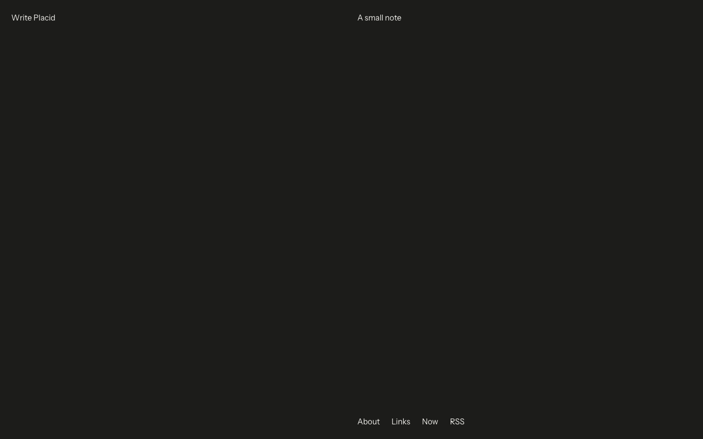
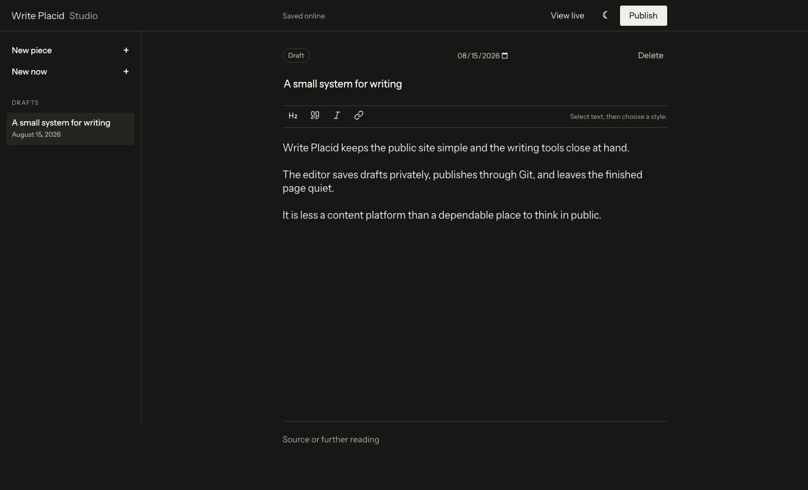
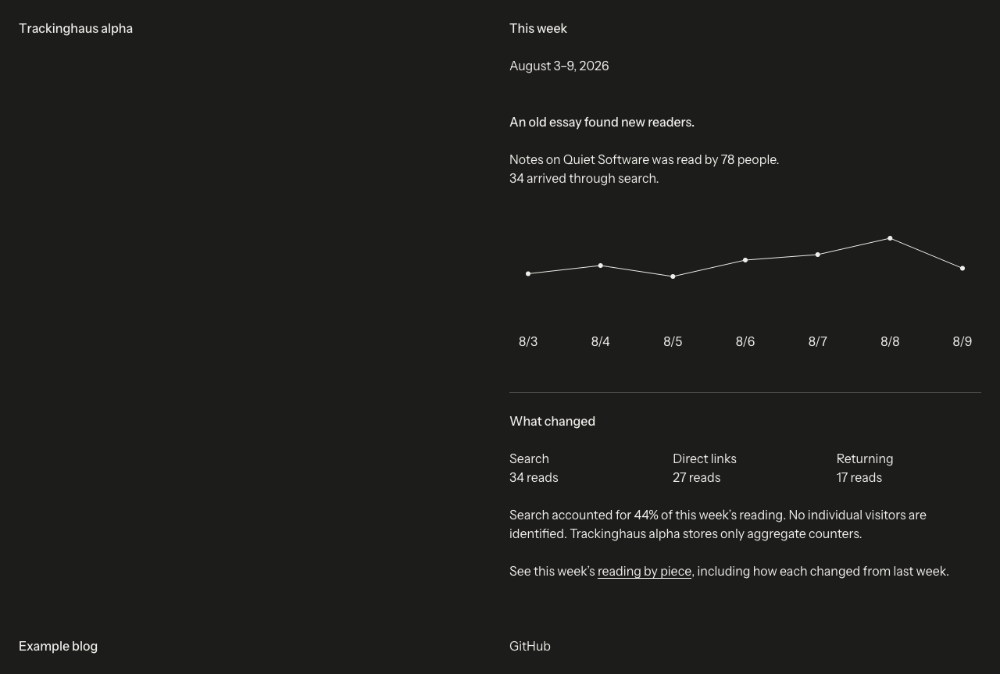

# Write Placid

An open-source, self-owned publishing system for quiet writing. [See the live template](https://maxpfennig.haus/write-placid/).

Write Placid packages the system developed for [Thinkinghaus](https://thinking.haus) without its personal writing, identity, credentials, or licensed typeface. It uses the open-source Instrument Sans family and ships with sample content that is safe to replace.



## What is included

- **[Site](apps/site/README.md)** — a fast public home for essays, pages, links, RSS, a single current `/now` entry, revision dates, and optional cached Webmentions.
- **[Studio](apps/studio/README.md)** — a private, phone-friendly rich-text editor that saves drafts to Cloudflare D1, optionally synchronizes KDrive or Google Docs, and publishes Markdown through GitHub.
- **[Drafts MCP](apps/drafts-mcp/README.md)** — an optional private bridge that lets a compatible AI assistant save a complete draft or revision to Studio without permission to publish or delete.
- **[Trackinghaus](apps/trackinghaus/README.md)** — optional, public, aggregate-only weekly analytics for the publication.

The pieces remain separate on purpose. A static public site has a much smaller failure surface than a CMS. Studio can be unavailable without taking the writing down. Tracking can be omitted entirely.

| Private Studio | Aggregate-only Trackinghaus |
| --- | --- |
|  |  |

## Start locally

Requirements: Node.js 22.13 or newer.

```bash
git clone https://github.com/mxpf/write-placid.git
cd write-placid
npm run setup
npm run dev:site
```

Open [localhost:3000](http://localhost:3000). Replace the sample Markdown in [`apps/site/content`](apps/site/content), then edit [`apps/site/site.config.json`](apps/site/site.config.json).

For the private [Studio](apps/studio/README.md), [Trackinghaus](apps/trackinghaus/README.md), and optional [Drafts MCP](apps/drafts-mcp/README.md), follow the [operator’s manual](docs/SETUP.md).

## Useful commands

```bash
npm run dev:site       # public publication
npm run dev:studio     # private editor
npm run dev:tracking   # aggregate analytics dashboard
npm run check          # config, builds, tests, and type checks
```

## A small design position

Write Placid is deliberately super normal. It uses a restrained type scale, ordinary links, generous space, and very little interface decoration. The system is meant to help a person return to the writing, not admire the publishing machinery.

## Ownership

The code is available under the [MIT License](LICENSE). Instrument Sans is covered by the [SIL Open Font License](docs/Instrument-Sans-OFL.txt). Your writing remains yours.

Thinkinghaus is Max Pfennighaus’s publication. Write Placid is the reusable system extracted from it.
